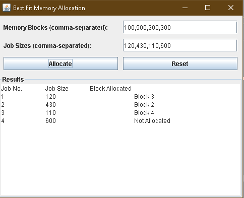

# Best Fit Memory Allocation

This project is a Java Swing application that demonstrates the **Best Fit Memory Allocation** algorithm. The graphical user interface allows users to input memory block sizes and job sizes, then allocate jobs to memory blocks using the best-fit strategy.

## Features

- **Dynamic User Input**- Accepts memory block and job sizes via a user-friendly interface.
- **Visualization**- Displays the allocation process and results in a formatted table.
- **Reset Functionality**- Allows users to clear inputs and start fresh.
- **Error Handling**- Detects and informs users of invalid inputs.

## Prerequisites

- **Java Development Kit (JDK)**- Version 8 or higher.
- An IDE or text editor such as **Visual Studio Code** or **IntelliJ IDEA**.

## How to Run

### Option 1- Using Visual Studio Code

1. Install the **Java Extension Pack** from the Extensions Marketplace.
2. Open the folder containing `BestFitGUI.java`.
3. Right-click the file and select **Run Java**.

### Option 2- Using Command Line

1. Open a terminal and navigate to the folder containing `BestFitGUI.java`.
2. Compile the file:
   ```bash
   javac BestFitGUI.java
   ```
3. Run the program:
   ```bash
   java BestFitGUI
   ```

### Option 3- Using IntelliJ IDEA

1. Open IntelliJ and import the folder as a project.
2. Add `BestFitGUI.java` to the `src` directory.
3. Click **Run** to execute the program.

## Example Input

- **Memory Blocks**: `100, 500, 200, 300, 600`
- **Job Sizes**: `212, 417, 112, 426`


## Example Output




